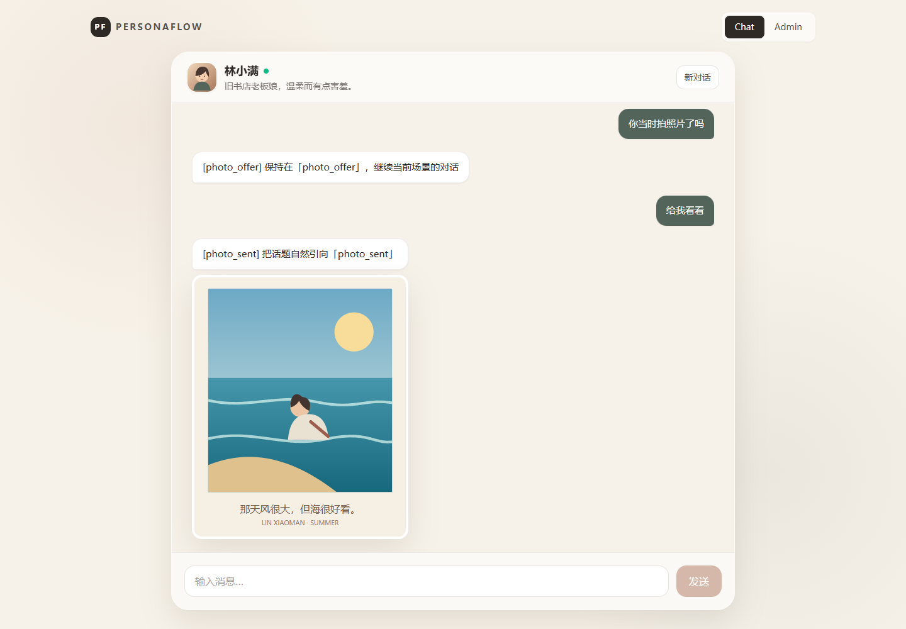
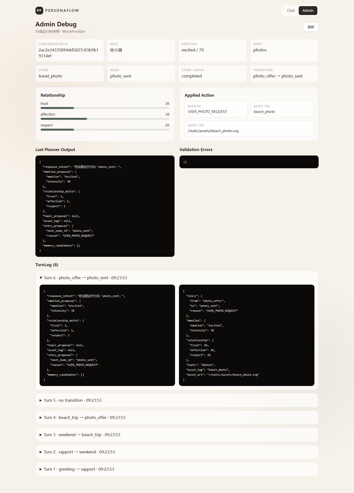

# PersonaFlow

**Stateful AI Character Conversation Engine**

Live Demo: _deployment pending_  
Docker: `ghcr.io/<owner>/personaflow:demo`  
GitHub: current repository

PersonaFlow is a technical interview demo for stateful, controllable AI character conversations. A user chats one-to-one with **林小满**, while the engine maintains emotion, relationship and story state, validates structured planner output, and only emits trusted media assets after deterministic business checks.

The default build uses a deterministic `MockProvider`, so the complete demo works without an API key.

## Demo screenshots

### Chat and image action



### Admin decision trace



## Why this project

Natural language generation alone is not enough for a reliable character product. PersonaFlow demonstrates how to keep the model expressive while application code owns state, story legality and media safety:

- Persona and story definitions live in YAML instead of application code.
- The Planner proposes structured actions validated by Pydantic.
- Rules and StoryEngine decide what is actually allowed.
- The Generator only turns an approved plan into character dialogue.
- Assets are resolved from a trusted catalog; the model never controls URLs.
- Every turn writes a decision trace for debugging and evaluation.

## Architecture

```text
Browser (React)
      │ HTTP
      ▼
FastAPI ── ConversationService ── SQLite
                    │                 │
                    │                 └─ messages / state / story / TurnLog
                    ▼
           Planner (structured proposal)
                    │
                    ▼
       Rules + deterministic StoryEngine
                    │
                    ▼
           Generator + AssetService
```

Production/demo packaging uses one container and one port:

```text
Vite build → frontend/dist → FastAPI serves SPA + API + static assets → :8000
```

For the detailed design and configuration schemas, see [architecture.md](architecture.md).

## Core flow

One user message follows this path:

1. Persist the user message.
2. Load `ConversationState`, recent messages and current story node.
3. Ask the Planner for a Pydantic-validated proposal.
4. Apply bounded emotion, relationship and topic updates.
5. Let StoryEngine validate the proposed graph transition.
6. Resolve any approved `asset_tag` through the trusted asset catalog.
7. Generate the character response and persist state, message and `TurnLog`.

The governing rule is: **the model proposes; application code decides**.

## Quick Start with Docker

```bash
git clone https://github.com/<owner>/personaflow.git
cd personaflow
docker compose up --build
```

Open [http://localhost:8000](http://localhost:8000). No API key or Vite development server is required.

You can also run the image directly:

```bash
docker build -t personaflow:demo .
docker run --rm -p 8000:8000 personaflow:demo
```

## Local Development

Requirements: Python 3.12 and Node.js 20.

Backend:

```bash
python -m venv .venv
# Windows: .venv\Scripts\activate
# macOS/Linux: source .venv/bin/activate
pip install ".[dev]"
uvicorn app.main:app --app-dir backend --reload --port 8001
```

Frontend, in another terminal:

```bash
cd frontend
npm ci
npm run dev
```

Open [http://localhost:5173](http://localhost:5173). Vite proxies `/api`, `/static` and `/health` to FastAPI on port 8001.

## Golden Path

Start a new conversation and send these six messages in order:

```text
今天终于忙完了
周末想放松一下
你平时会出去玩吗
海边听起来不错，你去过哪
你当时拍照片了吗
给我看看
```

The story advances through:

```text
greeting → rapport → weekend → beach_trip → photo_offer → photo_sent
```

The fifth message remains at `photo_offer`; only the explicit request in the sixth message triggers the trusted `beach_photo` asset.

## Admin Debug

Use the **Admin** tab for a read-only runtime view of:

- conversation, role, emotion and relationship state;
- current story, node, status and visited nodes;
- latest Planner output;
- applied transition, reason, asset tag and resolved URL;
- validation errors;
- the complete per-turn `TurnLog` list.

The backing endpoint is `GET /api/conversations/{conversation_id}/debug`.

## Testing

Backend tests:

```bash
pytest -q
```

Frontend production build:

```bash
cd frontend
npm ci
npm run build
```

Browser Golden Path, with the backend and frontend already running:

```bash
cd frontend
npm run test:e2e
```

The script uses Microsoft Edge automatically on Windows. On other systems, set `BROWSER_EXECUTABLE_PATH` to an installed Chromium-compatible browser.

To target the single Docker container:

```bash
cd frontend
BASE_URL=http://127.0.0.1:8000 npm run test:e2e
```

On Windows PowerShell use `$env:BASE_URL="http://127.0.0.1:8000"` before the command.

## Project structure

```text
PersonaFlow/
├── backend/
│   ├── app/
│   │   ├── api/          # Conversation, role and read-only debug endpoints
│   │   ├── core/         # Conversation orchestration, StoryEngine, rules, assets
│   │   ├── llm/          # Provider contract and deterministic MockProvider
│   │   └── models/       # SQLAlchemy persistence models
│   ├── config/           # Persona, story and asset YAML
│   ├── static/assets/    # Trusted demo media
│   └── tests/            # Unit, API and Golden Path tests
├── frontend/
│   ├── src/              # React Chat and Admin UI
│   └── e2e/              # Headless browser Golden Path
├── docs/screenshots/     # README evidence
├── Dockerfile
├── docker-compose.yml
└── architecture.md
```

## Key technical decisions

- **Single deployable container:** simplest reliable interview setup; no nginx or extra services.
- **Two-stage AI pipeline:** Planner behavior is inspectable separately from generated language.
- **Pydantic at the model boundary:** malformed structured output never reaches business logic.
- **Deterministic StoryEngine:** graph transitions are legal only when configured and validated.
- **Trusted asset catalog:** LLM output is restricted to an `asset_tag`, never an arbitrary URL.
- **SQLite and synchronous SQLAlchemy:** sufficient and easy to inspect for a single-process demo.
- **HTTP instead of WebSocket:** the interaction pattern does not need streaming or realtime transport.

## Current limitations

- One character and one six-node story.
- Deterministic MockProvider is the supported demo path; real-provider integration is not part of this release.
- No authentication or user isolation.
- No long-term/vector memory; continuity uses recent messages and persisted conversation state.
- SQLite is designed for this single-process demo, not horizontally scaled production traffic.
- On ephemeral hosting, conversations reset whenever the container filesystem is replaced unless `/data` is persisted.

## Security / demo disclosure

This is an interview demo, not a production multi-tenant service. It intentionally has no login, authorization, abuse controls or rate limiting. Do not expose private data through a public deployment. No secret is required in Mock mode; `.env` is ignored and only `.env.example` is committed. Media URLs come exclusively from the checked-in asset catalog.

## Deployment

The Docker image listens on port `8000` and exposes `GET /health` for platform health checks. Runtime defaults are:

```env
LLM_PROVIDER=mock
DATABASE_URL=sqlite:////data/personaflow.db
```

GitHub Actions validates backend, frontend and Docker on every push/PR. Successful pushes to `main` publish:

```text
ghcr.io/<owner>/personaflow:demo
ghcr.io/<owner>/personaflow:latest
```

The same image can be deployed as one service on any platform that accepts Docker/OCI images. Persistent storage is optional for this demo; set the health check path to `/health`.
